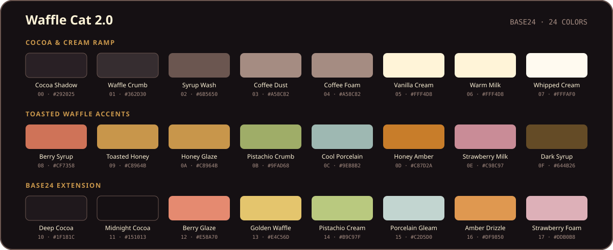

<p align="center">
  
</p>

<p align="center">
  <strong>A syrup-dark Base24 colorscheme for terminals, editors, and the command line.</strong><br>
  Cocoa shadows. Vanilla text. Honey amber where it matters.
</p>

<p align="center">
  <a href="https://github.com/OldJobobo/waffle-cat/releases/tag/v2.0.0"></a>
  <a href="palette/waffle-cat-base24.yaml"></a>
  <a href="LICENSE"></a>
  
</p>

<p align="center">
  <a href="#palette">Palette</a> ·
  <a href="#ports">Ports</a> ·
  <a href="#install">Install</a> ·
  <a href="#gallery">Gallery</a> ·
  <a href="#quality">Quality</a>
</p>

---

Waffle Cat is warm without turning sepia and colorful without becoming loud.
Its cocoa background is low-glare, its cream foreground stays crisp, and honey
amber carries the visual hierarchy. Berry red, pistachio green, porcelain cyan,
and strawberry pink are supporting voices—not a row of competing neon signs.

Version 2.0 is the finished palette: authored in the
[Omarchy Waffle Cat theme][omarchy-theme], translated here into portable,
validated formats, and preserved as both canonical Base24 and reduced Base16.

## Palette

<p align="center">
  
</p>

### Two canonical exports

| Palette | Purpose |
|---|---|
| [`waffle-cat-base24.yaml`](palette/waffle-cat-base24.yaml) | **Canonical.** Preserves the full dark ramp, explicit ANSI brights, and all authored Waffle Cat 2.0 values. |
| [`waffle-cat-base16.yaml`](palette/waffle-cat-base16.yaml) | **Compatible reduction.** Exactly `base00` through `base0F` for Base16-only consumers. |

The terminal palette does not guess ANSI roles from Base16 ordering. Every
normal and bright slot is mapped explicitly from the semantic Base24 palette.

## Ports

One palette, fourteen ready-to-use targets.

| Terminals | Editors | Command line |
|---|---|---|
| [Alacritty](configs/alacritty.toml) | [Neovim](colors/waffle-cat.lua) | [tmux](configs/tmux.conf) |
| [Foot](configs/foot.ini) | [Helix](configs/helix.toml) | [bat](configs/waffle-cat.tmTheme) |
| [Ghostty](configs/ghostty.conf) | [VS Code](configs/vscode-theme.json) | [delta](configs/delta.gitconfig) |
| [Kitty](configs/kitty.conf) | [Zed](configs/zed.json) | [fzf](configs/fzf.sh) |
| [WezTerm](configs/wezterm.lua) |  |  |
| [Warp](configs/warp.yaml) |  |  |

Generated files live in [`configs/`](configs/). The standalone Neovim
colorscheme lives in [`colors/waffle-cat.lua`](colors/waffle-cat.lua).

## Install

Start with one clone in a stable location:

```bash
git clone https://github.com/OldJobobo/waffle-cat.git \
  "$HOME/.local/share/waffle-cat"
```

Then wire in only the ports you use. The recipes below assume that clone path.

<details>
<summary><strong>Terminal emulators</strong> — Alacritty, Foot, Ghostty, Kitty, WezTerm, Warp</summary>

### Alacritty

Import Waffle Cat from `~/.config/alacritty/alacritty.toml`:

```toml
[general]
import = ["~/.local/share/waffle-cat/configs/alacritty.toml"]
```

### Foot

Add this at the top level of `~/.config/foot/foot.ini`:

```ini
include=~/.local/share/waffle-cat/configs/foot.ini
```

If your Foot version does not expand `~`, use the absolute path.

### Ghostty

Load the color fragment from `~/.config/ghostty/config`:

```ini
config-file = ~/.local/share/waffle-cat/configs/ghostty.conf
```

Test it first, if you like:

```bash
ghostty --config-file="$HOME/.local/share/waffle-cat/configs/ghostty.conf"
```

### Kitty

Add this to `~/.config/kitty/kitty.conf`:

```conf
include ~/.local/share/waffle-cat/configs/kitty.conf
```

### WezTerm

`configs/wezterm.lua` returns a complete colors-only configuration, ready for
local settings:

```lua
local config = dofile(os.getenv("HOME") .. "/.local/share/waffle-cat/configs/wezterm.lua")

-- Font, window, key, and domain settings can follow here.

return config
```

### Warp

On Linux, install the YAML theme into Warp's XDG data directory:

```bash
warp_themes="${XDG_DATA_HOME:-$HOME/.local/share}/warp-terminal/themes"
mkdir -p "$warp_themes"
ln -sfn \
  "$HOME/.local/share/waffle-cat/configs/warp.yaml" \
  "$warp_themes/waffle-cat.yaml"
```

Restart Warp and select **Waffle Cat** under Appearance.

</details>

<details>
<summary><strong>Editors</strong> — Neovim, Helix, VS Code, Zed</summary>

### Neovim

Install the standalone colorscheme:

```bash
mkdir -p "$HOME/.config/nvim/colors"
ln -sfn \
  "$HOME/.local/share/waffle-cat/colors/waffle-cat.lua" \
  "$HOME/.config/nvim/colors/waffle-cat.lua"
```

Select it from `init.lua`:

```lua
vim.cmd.colorscheme("waffle-cat")
```

The root [`neovim.lua`](neovim.lua) is an optional LazyVim selector. The
standalone colorscheme requires neither LazyVim nor Aether.

### Helix

```bash
mkdir -p "$HOME/.config/helix/themes"
ln -sfn \
  "$HOME/.local/share/waffle-cat/configs/helix.toml" \
  "$HOME/.config/helix/themes/waffle-cat.toml"
```

Set it in `~/.config/helix/config.toml`:

```toml
theme = "waffle-cat"
```

### VS Code

The repository ships a plain color-theme JSON. Install it as a small local
extension:

```bash
extension="$HOME/.vscode/extensions/oldjobobo.waffle-cat-2.0.0"
mkdir -p "$extension/themes"
cp "$HOME/.local/share/waffle-cat/configs/vscode-theme.json" \
  "$extension/themes/waffle-cat-color-theme.json"
cat > "$extension/package.json" <<'JSON'
{
  "name": "waffle-cat",
  "displayName": "Waffle Cat",
  "version": "2.0.0",
  "publisher": "oldjobobo",
  "engines": { "vscode": "^1.80.0" },
  "categories": ["Themes"],
  "contributes": {
    "themes": [{
      "label": "Waffle Cat",
      "uiTheme": "vs-dark",
      "path": "./themes/waffle-cat-color-theme.json"
    }]
  }
}
JSON
```

Restart VS Code and select **Preferences: Color Theme → Waffle Cat**.

### Zed

```bash
mkdir -p "$HOME/.config/zed/themes"
ln -sfn \
  "$HOME/.local/share/waffle-cat/configs/zed.json" \
  "$HOME/.config/zed/themes/waffle-cat.json"
```

Select **Waffle Cat** from Zed's theme selector.

</details>

<details>
<summary><strong>Command-line tools</strong> — tmux, bat, delta, fzf</summary>

### tmux

Add this to `~/.tmux.conf`:

```tmux
source-file ~/.local/share/waffle-cat/configs/tmux.conf
```

Reload with `tmux source-file ~/.tmux.conf`.

### bat

```bash
mkdir -p "$(bat --config-dir)/themes"
ln -sfn \
  "$HOME/.local/share/waffle-cat/configs/waffle-cat.tmTheme" \
  "$(bat --config-dir)/themes/waffle-cat.tmTheme"
bat cache --build
```

Add the following to bat's config file:

```text
--theme=waffle-cat
```

### delta

Install the bat theme first—delta uses it for syntax highlighting. Then include
the generated Waffle Cat feature from `~/.gitconfig`:

```gitconfig
[include]
    path = ~/.local/share/waffle-cat/configs/delta.gitconfig

[core]
    pager = delta

[interactive]
    diffFilter = delta --color-only

[delta]
    features = waffle-cat
```

### fzf

Source the generated shell fragment from `.bashrc`, `.zshrc`, or another
compatible startup file:

```bash
. "$HOME/.local/share/waffle-cat/configs/fzf.sh"
```

It preserves existing `FZF_DEFAULT_OPTS` and appends Waffle Cat's colors.

</details>

## Gallery

### Editor

<p align="center">
  
</p>

### Terminal and transparency

<table>
  <tr>
    <td width="50%"></td>
    <td width="50%"></td>
  </tr>
  <tr>
    <td align="center"><sub>Explicit ANSI + Base24 semantic roles</sub></td>
    <td align="center"><sub>85% opacity against a dark wallpaper</sub></td>
  </tr>
</table>

The full QA gallery includes Alacritty, Foot, Ghostty, Kitty, WezTerm, Neovim,
VS Code, and dark/light transparency checks in [`screenshots/`](screenshots/).

## Quality

Waffle Cat is tested as a palette system, not just checked by eye once.

| Check | Result |
|---|---:|
| Foreground on background | **14.45:1** |
| Muted text on background | **5.03:1** |
| Error red on background | **4.70:1** |
| Honey amber on background | **4.84:1** |
| ANSI bright colors | Brighter than every normal counterpart |
| Generated artifacts | Deterministic; stale output fails validation |

Visual review covers cursor visibility, selection, search, diagnostics, diff
states, ANSI normal/bright separation, and 85% opacity on light and dark
wallpapers. The complete record is in [`screenshots/QA.md`](screenshots/QA.md).

## Build from the palette

Generation requires Python 3.11+ and PyYAML.

```bash
# Regenerate every generated terminal and CLI target.
./scripts/generate-all.sh

# Validate palettes, editors, integrations, screenshots, and generated output.
./scripts/check-generated.sh

# Verify exact synchronization with the Omarchy source palette.
./scripts/validate-palettes.py \
  --source ~/Projects/themes/omarchy-waffle-cat-theme/colors.toml
```

Generated files identify themselves in their first line; edit the canonical
palette or generator instead. Representative Lua, Rust, Bash, Markdown, JSON,
and diff fixtures live in [`qa/`](qa/).

## The Omarchy connection

The completed [Omarchy Waffle Cat theme][omarchy-theme] is the visual authority
for Waffle Cat 2.0. Its `colors.toml` defines the semantic source values; this
repository carries those values into portable tools.

Omarchy-specific shell, GTK, Hyprland, Waybar, wallpaper, and desktop behavior
stay in the theme repository. If you want the complete desktop rather than the
portable colorscheme, install that project directly:

```bash
omarchy-theme-install https://github.com/OldJobobo/omarchy-waffle-cat-theme
```

## Versioning

Waffle Cat follows semantic versioning. Palette-compatible corrections are
patches, new ports and substantial compatible coverage are minors, and changes
to the canonical palette are majors. The final pre-2.0 palette remains
available from the [`alpha-final` tag][alpha-final].

## Credits

<p align="center">
  
</p>

Designed and maintained by [OldJobobo](https://github.com/OldJobobo).
Released under the [MIT License](LICENSE).

[alpha-final]: https://github.com/OldJobobo/waffle-cat/tree/alpha-final
[omarchy-theme]: https://github.com/OldJobobo/omarchy-waffle-cat-theme
